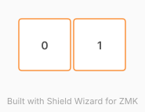

# ZMK Configuration for myunibody

*Generated by Shield Wizard for ZMK*



Download compiled firmware from the Actions tab. <https://zmk.dev/docs/user-setup#installing-the-firmware>

Edit your keymap <https://zmk.dev/docs/keymaps>.
User keymap is located at [`config/myunibody.keymap`](config/myunibody.keymap).

-----

<details>
<summary>
Shield Wizard Debug Information
</summary>

In case of broken configuration, here is the Shield Wizard internal data used to generate this configuration:

Commit: 84a348b08cf4fec4a5441a46147e9a345b10ffab

```json
{"name":"myunibody","shield":"myunibody","dongle":false,"modules":[],"layout":[{"id":"01M2TG62S4W4YHD6TSNZ12JDM4","part":0,"row":0,"col":0,"w":1,"h":1,"x":0,"y":0,"r":0,"rx":0,"ry":0},{"id":"01M2TG62XEZBSNQ275WSQTDDC5","part":0,"row":0,"col":1,"w":1,"h":1,"x":1,"y":0,"r":0,"rx":0,"ry":0}],"parts":[{"name":"unibody","controller":"rpi_pico","pins":{"gp6":{"usage":"kscan","kscan":"01M2TG69XVJWJB01SHWNPYNX7Z","role":"input"},"gp7":{"usage":"kscan","kscan":"01M2TG69XVJWJB01SHWNPYNX7Z","role":"input"},"gp0":{"usage":"bus","bus":"i2c0","role":"sda"},"gp1":{"usage":"bus","bus":"i2c0","role":"scl"}},"kscans":[{"kind":"direct","id":"01M2TG69XVJWJB01SHWNPYNX7Z","mode":"gnd"}],"keys":{"01M2TG62S4W4YHD6TSNZ12JDM4":{"input":"gp6"},"01M2TG62XEZBSNQ275WSQTDDC5":{"input":"gp7"}},"encoders":[],"buses":{"i2c0":{"type":"i2c","devices":[{"id":"01M2TG6JF8K4H42XBCKQ1BGF9A","type":"ssd1306","add":60,"width":128,"height":64}]}}}]}
```

</details>
